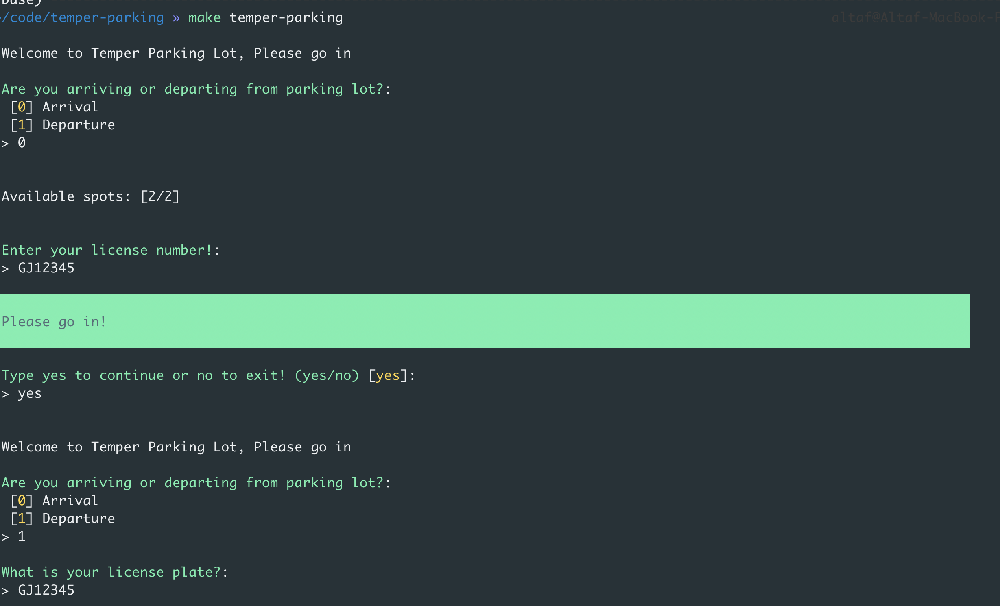
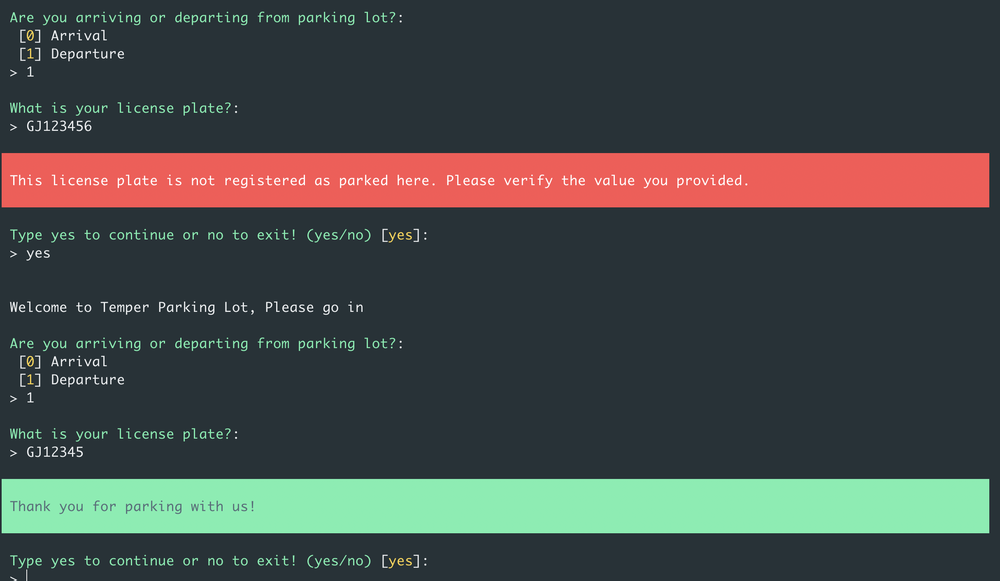

<p align="center"><a href="https://https://go.temper.works/" target="_blank"></a></p>

## Temper.works parking backend coding challenge
Please implement a software solution that will enable cars to park in a parking lot of 10 places.

Interactive CLI app for parking Arrival and Departure.
The project is created with
- OOP PHP (+DDD Application/Domain/Infrastructure)
- Sqlite memory
- Docker
- Console Command

## Installation

1. Do  ```make start``` to install the required libraries and do all magic. It will create the setup for the assignment and installation for you, If you are setting it up first time, please be patient as it will take some time.

2. Using Sqlite memory for the session, it ends when the console session is exited.
 
3. Use ```make temper-parking``` in terminal to execute the app. 

## Commands




## Explanation for Directory Structure

1) I have tried to use DDD and using console command
There are app variables inside an .env file including memory storage

Since I wanted to cover maximum functionalities, so I took liberty and used some composer packages for maximum output. 

2) `bin/console` is the place where execution begins
3) `config` folder, config files `config.yml` with parameters and `services.yml` takes care of dependency injection 

3) `Application - Domain - Infrastructure`: Tried to use DDD pattern for the code, where 
`Infrastructure` communicates with external libraries and implementation of contracts for domain, application layer
`Domain` where all the definition and interfaces stays
`Application` Where command and Query filters can stay, Commands represent intent for a system state change and must contain all the information that is necessary to successfully apply it to a system. Commands are physically placed in an application layer.

### Testcases
Due to time constraint I couldnt write phpunit test cases


